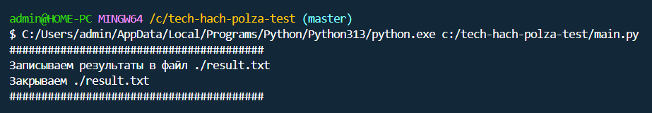
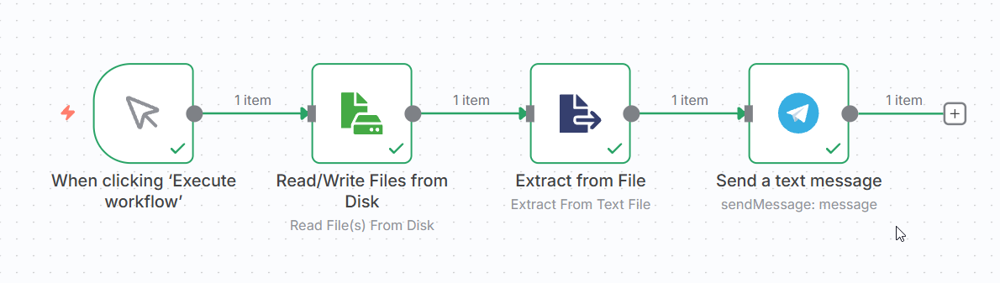

## Задание проверяет способность разбираться в новых задачах, работать с API, мыслить архитектурно и собирать рабочие решения.

### 1. Проверка email-доменов

Написать простой скрипт на Python, который:

✅ принимает список email-адресов;

✅ проверяет наличие MX-записей домена;

✅ выводит статус для каждого адреса:

- «домен валиден»;

- «домен отсутствует»;

- «MX-записи отсутствуют или некорректны».

Формат: один .py-файл + короткая инструкция по запуску.

#### Решение:

1. Открыть файл main.py через VSCode

2. Установить через терминал библиотеку **pip install dnspython**

3. Запустить main.py

### 2. Мини-интеграция с Telegram

Сделать небольшой скрипт или n8n-флоу, который:

✅ принимает текст из файла result.txt;

✅ отправляет этот текст в выбранный приватный Telegram-чат через Telegram-бота.

UI не нужен. Красивый код тоже не нужен. Главное — чтобы работало.

#### Решение:

1. Зайти на https://docs.n8n.io/hosting/installation/npm/

2. Установить n8n локально через терминал **npm install n8n -g**

3. Запустить n8n через терминал командой **n8n**

4. Создать новый поток и импортировать **polza-test-workflow.json**

### 3. Архитектурная задача

Предложить архитектуру, которая позволит обслуживать 1200 email-адресов для аутрича (несколько клиентов, несколько направлений), с минимальной стоимостью инфраструктуры и высокой отказоустойчивостью.

В ответ включить:

- описание архитектуры;
- какие сервисы и подходы используются;
- как работает ротация и мониторинг;
- как распределяется нагрузка;
- риски и способы их закрытия;
- примерную оценку стоимости.

Объём: 0,5–1 страница текста.

#### Решение:
